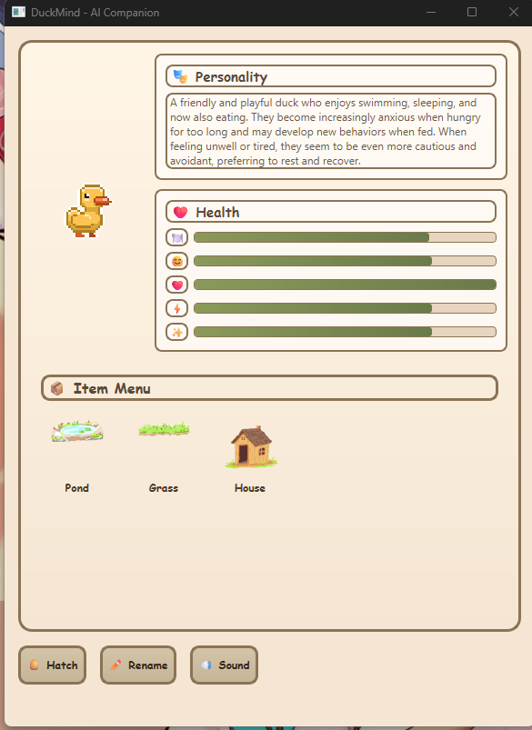
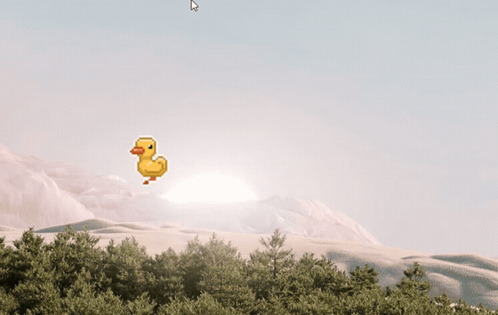

# DuckMind

I wanted a desktop pet that actually felt like company, not a spreadsheet with a sprite. DuckMind is a little tamagotchi-style duck you keep on your PC: you feed them, drag furniture onto the screen, and if you wire up the LLM stuff they can chat with you using memories of what you actually did together.

Under the cozy UI it is also my playground for **RAG**, **ChromaDB**, **sentence-transformers**, and a **local model via Ollama**. If you care about ML in games, that combo is the point: a character that can lean on retrieval instead of only whatever fits in the prompt window.

### Main menu

This is the home base: personality blurb, stat bars, the item row, and the duck in the box. Once they have hatched, you drag them out onto the desktop from there.



**Heads up:** drag the duck **out of this window** and let go on the wallpaper. On Windows, dropping on the empty desktop does not always look like a normal Qt drop, so the app treats “I dragged outside the menu” as good enough.

### On the desktop

Same recording as before, just as a GIF so GitHub shows it inline.



Sharper copy if you want it: [`videos/duck_desktop_walking.mp4`](videos/duck_desktop_walking.mp4)

---

## What I was going for

- A pet that gets hungry, tired, dramatic, the usual.
- Little props (pond, grass, house) you place yourself.
- Chat that can reference how you have been treating them, not generic filler, when the stack is running.
- A warm, Stardew-ish PySide6 look because I like software that does not feel like a bank portal.

---

## Why I think it matters for game-ish ML jobs

Recruiters skim for **systems**. This repo is one vertical slice: companion loop on screen, observer-style logging, embeddings in a vector DB, retrieval before generation, personality that can shift from what the game saw. Rough map:

| Idea | Where it lives |
| ---- | -------------- |
| Companion with stats and decay | Core sim + desktop window |
| Memory you can search | ChromaDB + `sentence-transformers` (`all-MiniLM-L6-v2`) |
| Dialogue that uses memory | RAG into prompts, then Ollama |
| Persona that can drift | Personality pipeline + LLM |
| Chat staying on-topic-ish | Topic filter |

Stack in plain text: Python, PySide6, ChromaDB, sentence-transformers, Ollama (I used `llama3.1:8b` in docs). If you need something copy-pasteable for applications, **[PROJECT_DESCRIPTION.md](PROJECT_DESCRIPTION.md)** is the long version I wrote for that.

---

## Flow (big picture)

```
You care for the duck → Observer logs events → Memories + embeddings (ChromaDB)
                                    ↓
              RAG retrieves “what kind of player is this?” context
                                    ↓
           Personality + chat use LLM with that context (Ollama)
```

More detail: **[ARCHITECTURE.md](ARCHITECTURE.md)** and **[memory/README.md](memory/README.md)**.

---

## Run it

You need Python 3.8+ and, for the AI side, [Ollama](https://ollama.ai). The toy still launches without Ollama; you just do not get the fancy chat/personality bits.

```bash
git clone https://github.com/Faizah-Binte-Naquib/Tamagotchi-Duck.git
cd tamagachi
python -m venv venv
```

Activate the venv (Windows PowerShell: `.\venv\Scripts\Activate.ps1`, cmd: `venv\Scripts\activate.bat`, macOS/Linux: `source venv/bin/activate`), then:

```bash
pip install -r requirements.txt
ollama pull llama3.1:8b
python main.py
```

Model and paths: **[SETUP_LLM.md](SETUP_LLM.md)**, `config/llm_config.py`.

---

## Playing

Feed, play, sleep, clean, medicine when they need it. After hatch, **drag the duck from the left box** to the desktop (not back onto the menu). Drag pond / grass / house from the row the same way. **Click the duck on the desktop** to open chat when everything is connected.

Autosave runs about every thirty seconds so you are not punished for closing the app on impulse.

---

## Where the code hangs out

```
tamagachi/
├── main.py              # Run this
├── duck_tamagotchi.py   # Core sim logic
├── desktop_duck.py      # Desktop window + duck presence
├── desktop_items.py     # Draggable world bits
├── llm/                 # Ollama client + RAG glue
├── memory/              # ChromaDB + embeddings
├── personality/         # Observer + personality engine + UI bits
├── chat/                # Chat + topic filter
├── config/              # LLM / paths
└── prompts/             # Prompts that teach the duck how to think
```

---

## Rough timings (my machine, YMMV)

Embeddings on CPU land around **10 to 50 ms** per memory; search over on the order of **1k memories** has been **50 to 200 ms** for me; LLM turns are usually **1 to 5 s** depending on model size. Give the machine **8 GB+ RAM** if you do not want the model to fight Chrome.

---

## License and thanks

**License:** [LICENSE](LICENSE) (MIT)

**Libraries:** [PySide6](https://www.qt.io/qt-for-python), [Ollama](https://ollama.ai), [ChromaDB](https://www.trychroma.com/), [sentence-transformers](https://www.sbert.net/)

If you clone this and something breaks, open an issue. I cannot promise the duck will apologize on my behalf, but I will read it.
